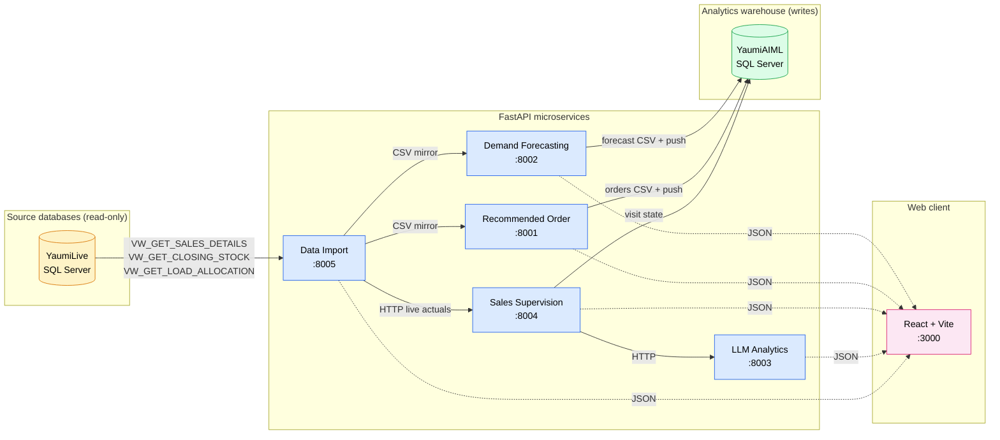
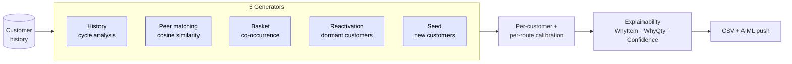
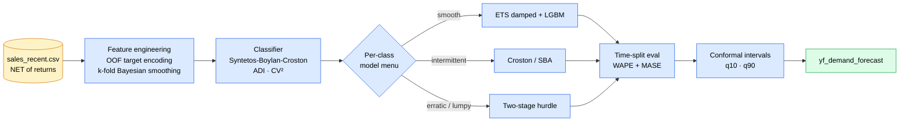
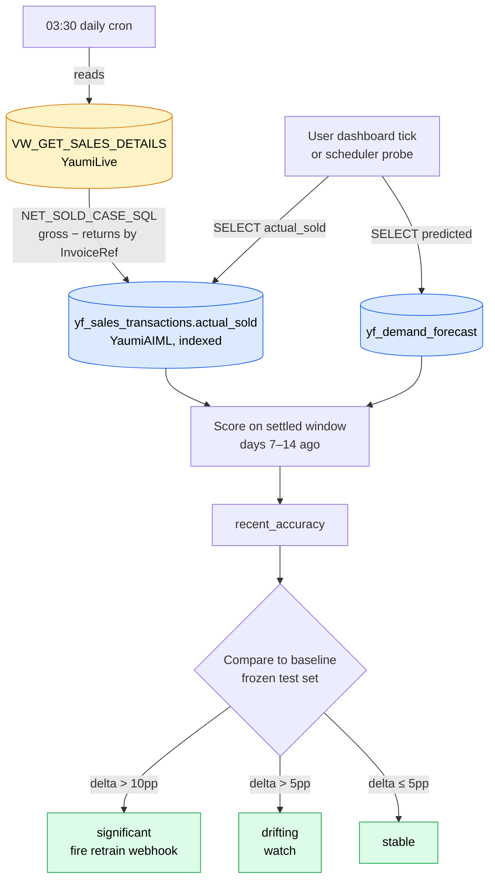
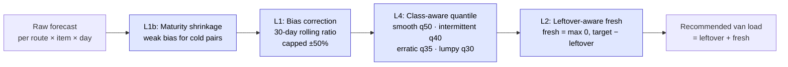

# Yaumi Flow

> **AI-powered demand forecasting and sales-execution platform** for FMCG van-distribution.
> Built for [Yaumi](https://www.yaumi.com/) (Rashed Al Rashed & Sons Group), United Arab Emirates.

[](https://github.com/dn-winit/Yaumi_Flow/actions)
[](https://www.python.org/)
[](https://react.dev/)
[](#license)

---

## What this platform does

| Layer | Question it answers | Powered by |
|---|---|---|
| **Forecast** | How much will each route sell of each item tomorrow? | `demand_forecasting` |
| **Recommend** | Which items should each customer order, in what quantity? | `recommended_order` |
| **Plan** | How much should the depot load onto each van today? | `reconciliation` engine |
| **Execute** | Did the rep actually visit and sell what we expected? | `sales_supervision` |
| **Analyze** | What story do today's numbers tell us? | `llm_analytics` |

Five FastAPI microservices, one React webapp, one shared design system. Read-only against the live ERP, write-only against the analytics warehouse.

---

## Contents

1. [System architecture](#system-architecture)
2. [Daily lifecycle](#daily-lifecycle)
3. [Services](#services)
4. [Webapp](#webapp)
5. [Quick start](#quick-start)
6. [Project layout](#project-layout)
7. [How it works](#how-it-works)
   - [Demand forecasting](#demand-forecasting)
   - [Drift detection](#drift-detection)
   - [Reconciliation engine](#reconciliation-engine)
   - [Past-performance scoring](#past-performance-scoring)
   - [Recommendation engine](#recommendation-engine)
8. [Source data](#source-data)
9. [Production deployment](#production-deployment)
10. [Testing](#testing)
11. [Design principles](#design-principles)
12. [License](#license)

---

## System architecture



**Single DB reader**: only `data_import` touches `YaumiLive`. Other services consume shared CSVs or call `data_import` over HTTP. Eliminates connection-pool contention against the production OLTP.

---

## Daily lifecycle

```mermaid
gantt
    title Cron schedule (Asia/Dubai)
    dateFormat HH:mm
    axisFormat %H:%M
    section Data
    Sales import (incremental)        :di, 03:00, 30m
    section Forecasting
    Reconciliation refresh + actuals  :rr, after di, 30m
    Drift check + auto-retrain gate   :dr, after rr, 10m
    section Orders
    Generate per-route recommendations :ro, after dr, 30m
    section Supervision
    Live polling (every 45s during the day) :crit, milestone, 06:00, 0m
```



Each scheduler is leader-elected via a filesystem advisory lock — under `uvicorn --workers N` only one worker per host fires the cron. Every cron tick writes one row into `yf_scheduler_log` for ops to confirm timely firing.

---

## Services

| Port | Service | Responsibility |
|---|---|---|
| `:8005` | **Data Import** | ETL from YaumiLive → CSVs, EDA aggregates, live customer lookups |
| `:8002` | **Demand Forecasting** | Training, inference, drift detection, reconciliation, past-performance API |
| `:8001` | **Recommended Order** | 5-generator recommendation engine, per-customer calibration, adoption tracking |
| `:8004` | **Sales Supervision** | Live visit scoring, redistribution, planned + unplanned customer flows |
| `:8003` | **LLM Analytics** | Provider-agnostic AI briefings, cached + rate-limited |

### `:8005` Data Import

- Incremental ETL from `YaumiLive` (SQL Server) — joins `VW_GET_SALES_DETAILS` against itself to subtract returns at the source (`NET_SOLD_CASE_SQL`)
- EDA aggregates: sales overview, business KPIs, forecast-vs-actual rows
- Live customer / route sales queries with 60-second server cache
- Cron: **03:00 Asia/Dubai**

### `:8002` Demand Forecasting

- ML ensemble per (route, item) with per-class model menu (Croston, SBA, ETS, LGBM, two-stage hurdle)
- Demand classification (Syntetos-Boylan-Croston: smooth / erratic / intermittent / lumpy)
- Conformal prediction intervals (split-CQR, Romano-Patterson-Candès 2019)
- Auto-retrain gate with drift detection (read-only against `yf_sales_transactions.actual_sold`)
- V2 reconciliation engine (L1 bias correction + L1b maturity shrinkage + L4 quantile loading + L2 leftover-aware fresh issuance)
- Past-performance API: rep van load vs recommended vs actually sold

### `:8001` Recommended Order



- Zero hardcoded business numbers — every threshold (frequency floor, dormancy window, tier cut, priority weight) derived per-route from observed data
- Engine filters customer history to `TrxDate < target_date` ("as-of cutoff") so today's already-completed sales never bias today's recommendations
- Adaptive feedback loop learning from supervision outcomes
- Per-row explainability (Signals, WhyItem, WhyQuantity, Confidence) + class-aware accuracy tolerance (smooth ±10%, intermittent ±20%, erratic ±30%, lumpy ±40%)

### `:8004` Sales Supervision

- Live session management for route supervisors
- Real-time visit scoring against `YaumiLive` actuals (fetched via `data_import`)
- Unsold-item redistribution to remaining planned customers
- Unplanned-visit detection with live polling
- Session save with file + database persistence

### `:8003` LLM Analytics

- Customer analysis, route review, pre-visit briefings
- Provider-agnostic (Groq / OpenAI / Anthropic) via configurable prompts
- TTL-bounded JSON cache + token-bucket rate limiting
- On-demand from the supervision UI

---

## Webapp

**React 18 · TypeScript · Vite · Tailwind CSS v4**

### Pages

| Page | Purpose |
|---|---|
| **Dashboard** | Business KPIs, sales trends, forecast accuracy, lost-opportunity tile |
| **Forecasting** | Pipeline status, model metrics, drift status, auto-retrain config |
| **Workflow → Plan** | Warehouse-grouped route grid → click route → Van Load detail with Past-performance + Upcoming-plan drawers |
| **Workflow → Visit** | Live supervision session (gated; requires a picked route) — planned + unplanned tiles, per-customer recording, AI briefings |
| **Admin** | Data-import status, LLM cache control |

### Design system

- Centralised tokens in `src/theme/tokens.ts` (Yaumi brand crimson + gold)
- Semantic Tailwind classes generated via `tailwind.config.ts`
- Reusable primitives: `Card`, `Badge`, `Button`, `Modal`, `Drawer`, `Tabs`, `Table`, `MetricCard`, `KpiRow`, `ContextStrip`, `HighlightsStrip`, `Skeleton`, `DatePicker`, `CommandPalette`
- Unified chart theming (`LineChart`, `BarChart`, `HorizontalBarChart`, `PieChart`) with auto `dd-mm-yyyy` date-axis formatting
- All rendered dates flow through `lib/date.ts#fmtDate` → user always sees `dd-mm-yyyy`; backend transport stays canonical `yyyy-mm-dd`

### Tiered React Query polling (`hooks/refresh.ts`)

| Tier | Cadence | Examples |
|---|---|---|
| `live` | 45 s | Visit session, unplanned-customer polling |
| `pipeline` | 10 s | Train / inference progress |
| `dashboard` | 5 min | KPIs, sales trends |
| `windowed` | 10 min | Past-performance, accuracy comparison |
| `static` | 1 h | Route registry, item catalog |

---

## Quick start

### Prerequisites

- Python 3.11+
- Node.js 18+
- ODBC Driver 17 for SQL Server
- Read access to `YaumiLive`; read/write to `YaumiAIML`

### Setup

```bash
# Clone and enter
cd forecast_new

# Python env (root requirements aggregates every service)
python -m venv .venv
source .venv/bin/activate            # macOS / Linux / Git Bash
# .venv\Scripts\activate              # Windows cmd / PowerShell
pip install -r requirements.txt

# Webapp dependencies
cd webapp && npm install && cd ..

# Environment
cp .env.example .env
# Edit .env with DB credentials + LLM keys
```

### Run

```bash
# All five backends + webapp, health-gated dependency-ordered startup
python scripts/serve_local.py

# Backends only (skip webapp)
python scripts/serve_local.py --skip-webapp
```

`Ctrl-C` tears every subprocess down cleanly. If any backend exits unexpectedly, the launcher kills the rest — mirrors Railway's "one bad process fails the deploy" semantics so local dev matches production.

### Run individually

```bash
python -m data_import                  # :8005
python -m demand_forecasting_pipeline  # :8002
python -m recommended_order            # :8001
python -m sales_supervision            # :8004
python -m llm_analytics                # :8003
cd webapp && npm run dev               # :3000
```

### Production build

```bash
cd webapp && npm run build       # outputs to webapp/dist/
```

### Docker

```bash
docker compose up --build        # 5 services + nginx-proxied webapp
```

---

## Project layout

```text
forecast_new/
├── common/                       Shared infra: db_pool, observability, sql_fragments,
│                                 sales_vocab, route_registry, carry_lookup, settings_base
│
├── data_import/                  ETL + EDA service               (:8005)
├── demand_forecasting_pipeline/  ML forecasting + reconciliation  (:8002)
├── recommended_order/            Recommendation engine            (:8001)
├── sales_supervision/            Live visit supervision           (:8004)
├── llm_analytics/                AI briefings + analytics         (:8003)
│
├── webapp/                       React + Vite frontend            (:3000)
│   ├── src/api/                  Axios clients per service
│   ├── src/components/           UI primitives + charts + layout
│   ├── src/config/               Routes, endpoints, query client
│   ├── src/hooks/                React Query + refresh tiers
│   ├── src/pages/                Dashboard, Workflow, Pipeline, Admin
│   └── src/theme/                Design tokens
│
├── tests/                        Pytest suite (hermetic + integration)
│   ├── common/                   In-process ASGI tests (CI-safe)
│   └── <service>/                Live-server integration tests
│
├── scripts/                      serve_local.py, backfill_*.py, create_tables.sql
├── data/                         Shared CSV directory (gitignored)
├── docker-compose.yml            5 services + webapp
├── Dockerfile.backend            Shared Python image
├── Dockerfile.frontend           nginx-served webapp build
├── nginx.conf                    Reverse proxy
├── render.yaml                   Render Blueprint (one-click deploy)
└── requirements.txt              Aggregator of per-service requirements
```

Every service follows the same internal layout: `api/` (FastAPI routes + schemas) · `config/` (Settings) · `core/` (domain logic) · `services/` (orchestration) · `__main__.py` (entry point).

---

## How it works

### Demand forecasting



**Class-aware composite accuracy.** Every accuracy surface — Pipeline baseline tile, drift recent, Past-performance drawer — routes through `composite_summary()` in `demand_forecasting_pipeline/src/evaluation/metrics.py`. Each item is held to a fair miss tolerance based on its demand class (smooth ±10%, intermittent ±20%, erratic ±30%, lumpy ±40%); only misses beyond tolerance feed the WAPE numerator. One helper, one tolerance map, mirrored in `webapp/src/lib/format.ts` — no parallel formulas can drift across surfaces.

### Drift detection



**Net actuals, settled window, frozen baseline.**
- `actual_sold` is pre-netted by the daily cron using the same `NET_SOLD_CASE_SQL` fragment training uses for `sales_recent.csv` (`common/sql_fragments.py`).
- Drift scoring uses `drift_lookback_days = 14` and `accuracy_settlement_window_days = 7` → window covers days 7-14 ago, past the typical FMCG return tail.
- Baseline is the frozen test-set accuracy from training time, never re-scored at query time → drift = honest `recent − baseline` on the same scale.
- 5-minute cache TTL absorbs UI traffic; cron-initiated refreshes bypass cache.

### Reconciliation engine



| Layer | Purpose | Formula |
|---|---|---|
| **L1b** | Maturity shrinkage | `effective_bias = bias_pct × min(1, n_active_days / threshold)` |
| **L1** | Bias correction | `P_corrected = Predicted / (1 + effective_bias)` |
| **L4** | Class-aware quantile load | `target = interpolate(q_low, P_corrected, q_high)` at class quantile |
| **L2** | Leftover-aware issuance | `fresh = max(0, target − leftover)` · `van_load = leftover + fresh` |

`bias_pct(route, item)` = rolling 30-day mean of `(Predicted − Actual) / Actual`, clipped at ±50%.
`q_low` / `q_high` come from the model's `q_10` / `q_90` columns. Missing quantile columns make L4 fall back to `target = P_corrected` for that row.

### Past-performance scoring

Plan → Past-performance drawer compares **what the rep actually did** against **what our model would have recommended**, scoped to the items we forecasted. Every number is auditable end-to-end.

**Item scope (the anchor):**

```text
ANCHOR = { ItemCode  |  exists in demand_forecast.csv
                       AND  RouteCode = route
                       AND  TrxDate   ∈ window
                       AND  Predicted > 0 }
```

Items the rep loaded but we didn't predict are **excluded**. We never claim phantom credit on items we made no call on.

**Window (`start_date`, `end_date`):**

| Surface | Default window |
|---|---|
| Dashboard | Trailing 30 calendar days through **today** |
| Past-performance drawer | Trailing 30 calendar days through **lastActiveDate** |
| Adoption drawer | Trailing 30 calendar days through **lastActiveDate** |

`lastActiveDate = MAX(TrxDate) FROM sales_recent` so the drawer never opens on a zero-data weekend. Both bounds ISO-validated; `start > end` returns `available=False` with a clear message.

**Rep van load (per day):**

```text
rep_van_load[d] = past_leftover[d] + today_allocation[d]
```

| Component | Source | Definition |
|---|---|---|
| `past_leftover[d]` | `VW_GET_CLOSING_STOCK` | `ClosingQty` on `(d − 1)` for anchor items. Missing row → `0` (no forward-fill). |
| `today_allocation[d]` | `VW_GET_LOAD_ALLOCATION_DETAILS` | `Σ AllocatedPC` for `(route, d, anchor items)`. Missing row → `0`. |

**Why "missing = 0" is correct:** the source schema **never logs `ClosingQty = 0`** — when an item sells out, the row simply disappears. A missing row IS the system's way of saying "nothing left." Empirically validated on **21,073 (item, day) cells across all 12 routes × 60 days**:

- **94.4%** of missing-closing cells also satisfy the operational identity for zero leftover
- **5.6%** of cells have unrecorded leftover, dominated by *"allocated but never physically loaded"* depot rows the views can't disambiguate
- Closing logging frequency tracks demand class: lumpy SKUs 81%, smooth SKUs 2% — closings appear exactly when leftover physically exists

Rep van load is a **floor**, never an over-claim.

**Recommendation match (window total):**

```text
recommendation_match_pct  =  min(recommended_total, actual_sold_total)
                             /  max(recommended_total, actual_sold_total)
                             ×  100
```

Symmetric bounded fill-ratio in `[0, 100]`. A 2× over-allocation and a 0.5× under-allocation both score 50%.

**Holding cost saved (window total):**

```text
rep_excess_i  =  max(rep_van_load_i           − sold_i, 0)
our_excess_i  =  max(recommended_van_load_i   − sold_i, 0)

holding_savings = Σ_i (rep_excess_i − our_excess_i) × avg_unit_price_i
```

`avg_unit_price_i` is quantity-weighted from `AvgUnitPrice` on `VW_GET_SALES_DETAILS` over the same `(route, anchor, window)` slice. `max(·, 0)` excludes under-allocated items — those are a lost-sales cost, not a holding cost.

**Identity guarantee.** For any window and any filter, chart-sum equals tile-total for every series:

```text
Σ_d  rep_van_load[d]            ==  rep_van_load_total
Σ_d  recommended_van_load[d]    ==  recommended_van_load_total
Σ_d  actual_sold[d]             ==  actual_sold_total
```

Verified by API contract — daily values and aggregate totals are computed from the same anchor-scoped queries.

### Recommendation engine

Five generators run per (route, target_date). Each customer carries a **profile** (HEAVY / MEDIUM / LIGHT basket tier, personal completion gate, personal recency half-life) derived from their own history — zero hardcoded business numbers.

| Generator | When it fires | Signal |
|---|---|---|
| **History** | Customer has ≥ N prior purchases | Cycle-based pattern of each customer's buying rhythm |
| **Peer** | History is thin / cold | Cosine similarity to lookalike customers on the same route |
| **Basket** | Always | Items frequently bought together within the same trip |
| **Reactivation** | Customer dormant > `dormancy_days` | Top van items for dormant-segment win-back |
| **Seed** | First-time / unknown customer | Top van items for cold start |

Engine filters customer history to `TrxDate < target_date` (the "as-of cutoff") so today's already-completed sales never bias today's recommendations. Adaptive feedback loop reads supervision outcomes and re-weights signals weekly.

---

## Source data

The platform reads **four SQL Server views** from YaumiLive. Only `data_import` and the demand_forecasting reconciliation cron touch them directly.

| View | Used for | Key columns |
|---|---|---|
| `VW_GET_SALES_DETAILS` | Sales + returns (single source, split by `TrxType`) | `TrxType`, `ItemType`, `QuantityInPCs`, `UnitPrice`, `TrxDate`, `RouteCode`, `ItemCode`, `TrxCode`, `ReturnItem_InvoiceRef` |
| `VW_GET_LOAD_ALLOCATION_DETAILS` | Today's depot-issued allocation | `AllocatedPC`, `TrxDate`, `RouteCode`, `ItemCode` |
| `VW_GET_CLOSING_STOCK` | End-of-day stock per (route, item) | `ClosingQty`, `TrxDate`, `RouteCode`, `ItemCode` |
| `VW_GET_LOAD_REQUEST_DETAILS` | Rep's load request (vs allocation) | Reserved for future fulfilment-gap reporting |

### TrxType vocabulary (canonical, `common/sales_vocab.py`)

| TrxType | ItemType | Sign of `QuantityInPCs` | Used as |
|---|---|---|---|
| `SalesInvoice` | `OrderItem` | Positive | `sold` |
| `Bad Return` | `OrderItem` | Negative (sign-flipped) | `bad_return` (damaged write-off) |
| `Good Return` | `OrderItem` | Negative (sign-flipped) | `good_return` (saleable back to depot) |
| `SalesInvoice` | `FreeItem` | Positive | Filtered out (promo / sample) |

### AIML warehouse tables (the writes)

| Table | Owner | Purpose |
|---|---|---|
| `yf_demand_forecast` | `demand_forecasting.db_pusher` | Predictions per (route, item, date) with quantile bounds + demand class |
| `yf_sales_transactions` | `demand_forecasting.reconciliation_refresh` | Pre-netted `actual_sold`, carry chain, engine math, envelope diagnostics |
| `yf_recommended_orders` | `recommended_order.db_pusher` | Per-customer recommendations with explainability fields |
| `yf_supervision_customers` | `sales_supervision.db_saver` | Visit state per supervised customer |
| `yf_scheduler_log` | `common.scheduler_audit` | One row per cron fire (audit trail) |

---

## Production deployment

### Multi-worker

Every scheduler-bearing service uses filesystem leader-election (`common.leader_election`) so under `uvicorn --workers N` only ONE worker per host fires the cron. Followers boot the API but skip the scheduler.

| Service | Lock path (default) | Env override |
|---|---|---|
| `data_import` | `<data-root>/imports/scheduler.lock` | `DI_SCHEDULER_LOCK_PATH` |
| `demand_forecasting` | `<data-root>/forecast/scheduler.lock` | `DF_SCHEDULER_LOCK_PATH` |
| `recommended_order` | `<data-root>/recommendations/scheduler.lock` | `RO_SCHEDULER_LOCK_PATH` |
| `sales_supervision` | `<data-root>/supervision/scheduler.lock` | `SS_SCHEDULER_LOCK_PATH` |

Filesystem-scoped advisory lock (POSIX `flock` / Windows `msvcrt.locking`); kernel releases on process exit.

> **Multi-host deployments need a distributed lease** layered on top — the current lock only coordinates workers within one host. Set `YF_LEADER_LOCK_DISABLE=1` only for single-worker dev / tests where the lock file is unavailable.

### CI/CD

Four hard gates on every push to `staged` / `main`:

| Gate | Tool | Scope |
|---|---|---|
| Python compile | `compileall` | Every `.py` file syntax-checks |
| Webapp lint + typecheck | `eslint` + `tsc --noEmit` | Strict TS, no `any` shortcuts |
| Python lint | `ruff` | E + F + W + I + B + UP rules |
| Python tests (hermetic) | `pytest -m "not slow and not requires_db and not requires_live_server"` | In-process ASGI suite |

The live-DB integration suite auto-skips on hermetic runs (no GitHub-hosted DB access). Local pre-push runs exercise the full suite when DB credentials are present.

### Docker

```bash
docker compose up --build
```

5 backend services on the shared `Dockerfile.backend` + nginx-proxied webapp on `Dockerfile.frontend`. Reverse-proxy routing rules in `nginx.conf`.

### Render Blueprint

One-click multi-service deploy via `render.yaml`.

---

## Testing

```bash
# Default: skip slow tests + live-DB tests
pytest tests/

# Per-module
pytest tests/data_import/  tests/sales_supervision/  ...

# Include LLM calls / full reconciliation refreshes
pytest tests/ -m "slow or not slow"

# Verbose + stop on first failure
pytest tests/ -vx

# Hermetic suite only (CI-safe, no DB / no live server)
pytest tests/common/
```

### Markers (`pyproject.toml`)

| Marker | Meaning |
|---|---|
| `slow` | Real LLM endpoints or multi-minute reconciliation |
| `requires_db` | Live YaumiAIML connection (auto-skip when unset) |
| `requires_live_data` | Today's plan on at least one configured route |
| `requires_live_server` | All 5 backends reachable on configured ports |

The conftest auto-attaches `requires_live_server` to `tests/<service>/` modules so a hermetic CI run only executes `tests/common/`.

### Lint / format

```bash
pip install ruff
ruff check .          # E, F, W, I, B, UP rules from pyproject.toml
ruff format .         # in-place formatter
```

---

## Design principles

| Principle | What it means |
|---|---|
| **Single DB reader** | Only `data_import` queries `YaumiLive`. Other services read shared CSVs or call `data_import` over HTTP. Zero connection-pool contention against the OLTP. |
| **Single source of truth** | Every TrxType, table FQN, view name, and SQL fragment flows from `common/` (sales_vocab, sql_fragments, route_registry) or Settings. Env override propagates to every consumer. |
| **File-based recommendation store** | One CSV per route-date. `DbPusher` replicates to `YaumiAIML` as a one-way sync. No dual-write race conditions. |
| **Data-driven calibration** | Recommendation thresholds (frequency floor, dormancy window, tier cuts, priority weights) computed per-route from observed data. Zero hardcoded business numbers in the engine. |
| **Class-aware composite accuracy** | One helper, one tolerance map. Pipeline tile, drift recent, Past-performance drawer — all route through the same `composite_summary()`. Mirrored in `webapp/src/lib/format.ts` so no parallel formulas can drift. |
| **Atomic DB writes** | Every push runs `DELETE+INSERT` in a single transaction with `try/finally` + explicit rollback. Bulk writes carry `cursor.timeout` so a slow warehouse cannot hang the writer. |
| **Linear Plan → Visit flow** | Visit is reachable only after a route is picked in Plan (URL guard + disabled stepper step + gated keyboard shortcut). No accidental jumps into a stale-context session. |
| **One canonical date format** | Backend speaks `yyyy-mm-dd`; UI funnels every rendered date through `lib/date.ts#fmtDate` → `dd-mm-yyyy`. |
| **Centralised request budgets** | `webapp/src/api/client.ts#TIMEOUTS` exposes `default` (30 s) and `heavy` (3 min). Every long-running mutation reads from the same constant. |
| **Tiered polling** | React Query hooks share 5 refresh tiers so every metric stays current without re-fetch storms. |
| **Conservative reconstruction** | When source data is incomplete, we under-claim rather than fabricate. Past-performance leftover uses *direct* prior-day `ClosingQty` only — no forward-fill, no extrapolation. Validated empirically across 21,073 cells. |
| **Pre-netted actuals at write time** | `yf_sales_transactions.actual_sold` is netted-of-returns once per day by the cron (`NET_SOLD_CASE_SQL`). Drift queries READ that column instead of re-scanning the YaumiLive view — ~2 s vs ~60 s, same scale as training target. |
| **Settled window for drift** | `drift_lookback_days=14` paired with `accuracy_settlement_window_days=7` so the scored window sits past the typical return tail. Recent accuracy and baseline accuracy stay on the same scale; no false-drift artefact from unsettled returns. |

---

## License

Proprietary — Yaumi / Rashed Al Rashed & Sons Group. All rights reserved.
